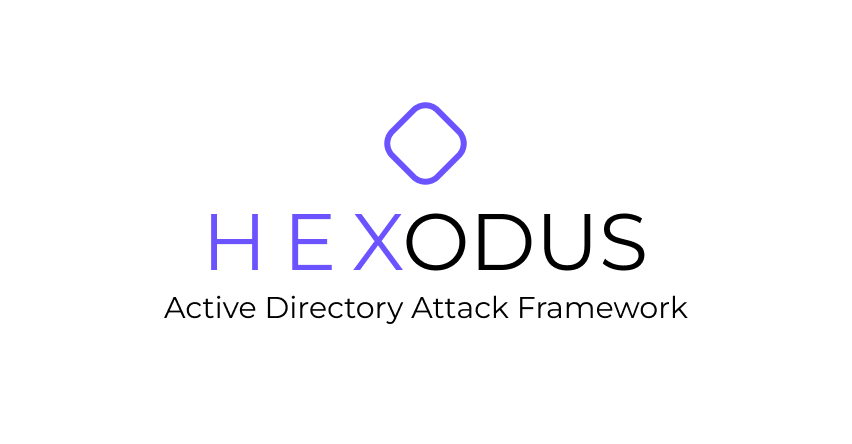

<p align="center">
    <picture>
        
    </picture>
</p>

<hr/>

🟪 Hexodus is a Python framework project designed to enumerate and help in Active Directory attacks through Windows protocols like SMB, LDAP, WinRM and other. It uses MySQL databases to store the data and Django to generate a web-view of the data collected, making easier to analyze the environment.

<br>

## Documentation
In the [documentation](https://github.com/000pp/hexodus/wiki) you can find orientations of how to use Hexodus commands, known errors by the community or the developer(s) and a possible solution for the problem.

<br>

## Installation
It's suggested to use [pipx](https://github.com/pypa/pipx) to install the project locally, so you can run it from everywhere and make the things easier.

### Linux
```
sudo apt install pipx git
pipx ensurepath
pix install git+https://github.com/000pp/hexodus
```

### MacOS
```
brew install pipx
pipx ensurepath
pix install git+https://github.com/000pp/hexodus
```

### Local
```
git clone https://github.com/000pp/hexodus.git
pipx install .
```

### Updating
```
pipx reinstall hexodus
```

<br>

## Usage


<br>

## Credits
- [NetExec](https://github.com/Pennyw0rth/NetExec)
- [Impacket](https://github.com/fortra/impacket)
- [SecTools](https://github.com/p0dalirius/sectools)
